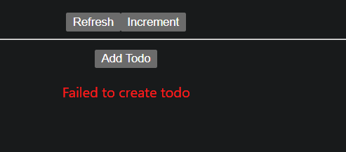

Todo app showing how react tanstack query works
source to learn - https://www.youtube.com/watch?v=mPaCnwpFvZY&t=295s
+ GPT

This project demonstrates how to use React Query v5 (@tanstack/react-query) with Suspense, Error Boundaries, and mutations.

🚀 Features

Fetch (GET) data using useSuspenseQuery

Handles loading with <Suspense fallback={...}>

Handles errors with <ErrorBoundary>

Create (POST) data using useMutation

Submits a new Todo item

Displays the created id from the server response

Query Invalidation support (via refetch)

Example API: JSONPlaceholder

🛠️ Tech Stack

React 18+

@tanstack/react-query v5

JSONPlaceholder (fake REST API)

---
✅ What You Learn

How to fetch data with useSuspenseQuery

How to handle loading with Suspense

How to handle errors with ErrorBoundary

How to create data with useMutation

How to access mutation results (e.g., created id)
---

We can have to main methods one for quering and one for mutation.

Benfits - It provide props like loading, fetching, data, error so we dont have to write login for it.   

Get success showing json data

Post success

Post error
